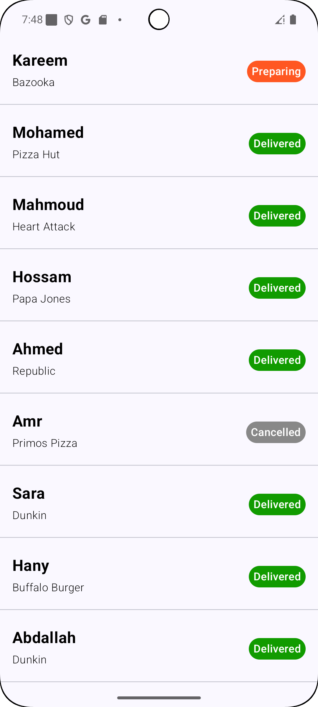
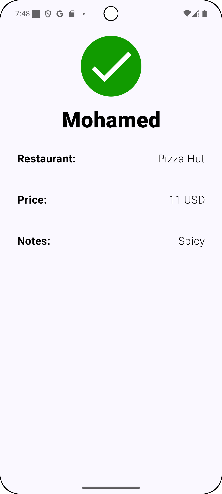
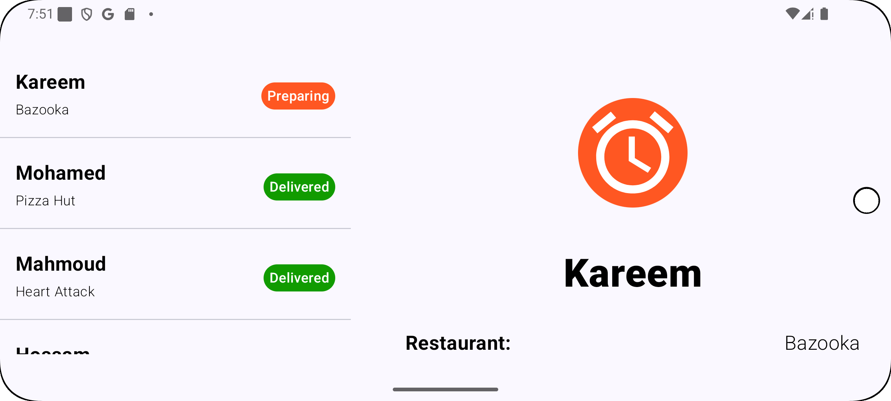

# Food Delivery App

- User can see a list of his orders
- User can select an order to show its details
- User can use the app online and offline
- User can see the order status change in real-time
  
# Technologies used

- Jetpack Compose
- Dagger Hilt
- Retrofit
- Room Database
- Websocket
- Coroutines
- Flow
- Clean Architecture

# Build instructions

- If you're running the app on a real device, head to build.gradle (App) and change the base_url buildConfig field from http://10.0.2.2:8080/ to http://localhost:8080/ and vice versa
- This project is built with AGP 8.9.1 and Kotlin 2.0.21

# Architectural Decisions

I went with a Layered Architecture for high scalability that can support implementing a lot more features, Maintainability & Testability (abstraction layers), and the support of the addition of business logic (domain layer).

# Trade-offs
- Increased Boilerplate: More classes and interfaces are required even for simple features, which can feel verbose for small projects.
- Features are coupled with the data layer

I was thinking about a feature-based architecture where each feature is isolated with its own layers so they can be reused in any other project but decided not to go with that since the data layer is the one that would be mostly reused in this kind of apps

# API
I used a simple Node.js server for my backend 

# AI
AI was used only to create the Node.js server

